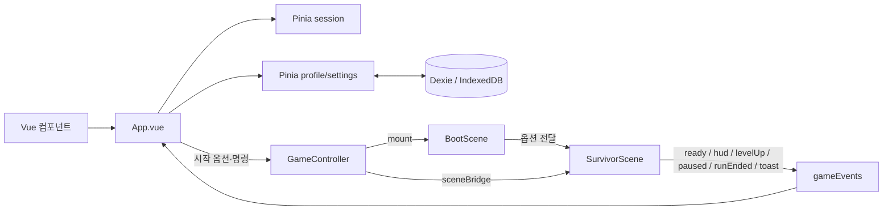
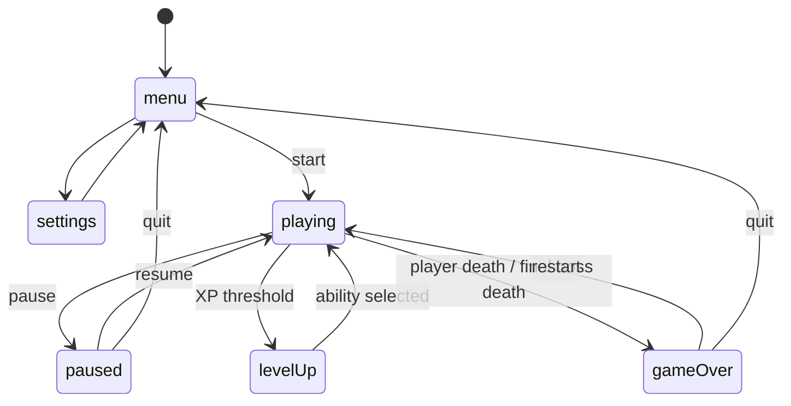

# Relaywake 코어 로직과 실행 파이프라인

이 문서는 현재 저장소의 코드를 기준으로 앱 시작부터 게임 런 종료와 로컬 저장까지의 실제 실행 흐름을 설명한다. 게임 규칙의 최종 소스는 `src/game/data`, 실시간 시뮬레이션의 최종 소스는 `src/game/scenes/SurvivorScene.ts`다.

## 1. 시스템 개요

앱은 크게 두 개의 런타임으로 나뉜다.

- **Vue 3 + Pinia**: 메뉴, 설정, HUD, 오버레이, 화면 상태, 프로필과 설정 상태를 담당한다.
- **Phaser 4**: 플레이어, 적, 무기, 충돌, 보상, 카메라, 애니메이션, 효과음 등 한 번의 게임 런을 시뮬레이션한다.

두 런타임은 직접 상태를 공유하지 않는다. Vue에서 Phaser로 보내는 명령은 `GameController`와 `sceneBridge`를 거치고, Phaser에서 Vue로 보내는 상태는 타입이 지정된 `gameEvents` 이벤트 버스를 거친다.



### 상태 소유권

| 상태 | 소유자 | 수명 |
|---|---|---|
| 현재 화면, HUD 스냅샷, 레벨업 선택지, 결과 요약 | `stores/session.ts` | 앱 세션 |
| 누적 코인, 최고 기록, 총 런 수 | `stores/profile.ts` + Dexie | 브라우저 로컬 영속 |
| 언어, 사운드, 화면 흔들림, 피해 숫자 | `stores/settings.ts` + Dexie | 브라우저 로컬 영속 |
| 플레이어, 적, 투사체, 드롭, 능력, 런 타이머 | `SurvivorScene` | 한 번의 런 |
| 캐릭터·적·능력·레벨 규칙 | `game/data/*` | 정적 설정 |

## 2. 앱 부팅과 런 생성

### 앱 부팅

1. `src/main.ts`가 Vue 앱과 Pinia를 만들고 `App.vue`를 마운트한다.
2. `App.vue`는 프로필과 설정을 `Promise.all`로 동시에 hydrate한다.
3. Dexie 초기화나 읽기가 실패해도 기본 인메모리 값으로 앱은 계속 동작하며, 저장소 사용 불가 토스트를 표시한다.
4. `gameEvents`의 `ready`, `hud`, `levelUp`, `paused`, `runEnded`, `toast` 리스너를 등록한다.

### 런 시작

메뉴에서 캐릭터와 필드를 선택하면 다음 순서로 진행된다.

1. 기존 Phaser 인스턴스를 `gameController.destroy()`로 정리한다.
2. `session.start(characterId)`가 HUD와 결과를 초기화하고 화면을 `playing`으로 전환한다.
3. `StartRunOptions`를 만든다.
   - 캐릭터 ID
   - 필드 테마 ID
   - 현재 설정의 스냅샷
   - 일반 실행은 `Date.now()`, E2E 실행은 고정값 `20260729`인 RNG 시드
4. `runKey`를 증가시켜 `GameViewport`를 새로 마운트한다.
5. `GameViewport`가 `gameController.mount(container, options)`를 호출한다.
6. `GameController`는 옵션을 `runtimeContext`에 임시 보관하고 Phaser 게임을 생성한다.
7. `BootScene`이 Phaser용 이미지와 스프라이트시트를 로드하고 애니메이션을 등록한다.
8. `BootScene`이 임시 옵션을 한 번 소비하여 `SurvivorScene`을 시작한다.
9. `SurvivorScene.init()`이 시드 RNG, `AbilityDirector`, `SpawnDirector`를 만든다.
10. `SurvivorScene.create()`가 배경, 플레이어, 입력, 초기 경험치 보석을 만든 뒤 활성 씬으로 연결되고 `ready`와 최초 HUD를 발행한다.

런 도중 설정 스토어가 바뀌어도 이미 시작된 런에는 즉시 반영되지 않는다. 사운드·화면 흔들림·피해 숫자·언어는 런 시작 시 복사된 `preferences`를 사용한다.

## 3. 화면 상태 머신

`session.screen`은 다음 여섯 상태 중 하나다.



레벨업과 수동 일시정지는 모두 Phaser 시뮬레이션을 멈추지만 UI 상태는 구분한다. `levelUp` 상태에서 들어오는 일반 `paused: true` 이벤트는 레벨업 창을 수동 일시정지 창으로 덮어쓰지 못한다.

## 4. 메인 게임 루프

`SurvivorScene.update()`는 씬이 일시정지되었거나 종료되었으면 즉시 반환한다. 프레임 지연이 커져도 한 번의 시뮬레이션 스텝은 최대 `0.05초`로 제한한다.

활성 프레임의 처리 순서는 다음과 같다. 이 순서는 충돌과 타깃 검색 결과에 직접 영향을 준다.

1. 경과 시간, HUD/컴팩션/자석 타이머, 플레이어 무적 시간을 갱신한다.
2. 카메라 위치에 맞춰 타일 배경 레이어를 갱신한다.
3. 키보드 또는 터치 입력으로 플레이어 이동을 계산한다.
4. 모든 보유 능력의 쿨다운을 감소시킨다.
5. 재생 패시브의 주기 회복을 처리한다.
6. 일반 적, 미니보스, 최종 보스, 정기 상자를 스폰한다.
7. 적 이동, 상태 이상, 근접/원거리 공격을 처리한다.
8. 최종 보스 이탈 감지와 재배치를 처리한다.
9. 공간 해시를 이용해 적끼리 겹치지 않도록 분리하고, 보정된 위치로 해시를 다시 만든다.
10. 적 스프라이트 위치를 동기화한다.
11. 공전 무기와 충돌을 처리한다.
12. 쿨다운이 끝난 일반 액티브 무기를 자동 발동한다.
13. 근접 효과를 이동·충돌·만료 처리한다.
14. 투사체를 이동·충돌·만료 처리한다.
15. 화염/중력 장판을 처리한다.
16. 드롭의 자석 이동과 획득을 처리한다.
17. 약 `0.7초`마다 비활성 엔티티를 배열에서 제거한다.
18. 약 `0.08초` 간격으로 HUD 스냅샷을 발행한다. 중요한 변화는 강제로 즉시 발행한다.

## 5. 플레이어와 입력

- 방향키 또는 WASD 입력이 있으면 키보드 입력이 터치 벡터보다 우선한다.
- 입력 벡터는 정규화하여 대각선 이동이 더 빨라지지 않게 한다.
- 목표 속도는 `캐릭터 이동 속도 × 전역 이동 속도 배율`이다.
- 현재 속도는 캐릭터의 가속도로 목표 속도에 접근한다. 입력이 없는 축은 `0`으로 감속한다.
- 이동 방향이 있으면 캐릭터가 좌우 반전되고 걷기 애니메이션이 재생된다.
- 카메라는 플레이어 스프라이트를 완만하게 추적한다.
- 터치 스틱은 pointer capture를 사용한다. 비활성화, 포인터 종료, 창 blur, 문서 숨김 시 입력 벡터를 반드시 `0, 0`으로 되돌린다.

## 6. 스폰과 난이도 파이프라인

`SpawnDirector`는 `elapsedSeconds / durationSeconds`를 `0..1` 진행도로 정규화한다.

```text
진행도
  → spawnRate 곡선 선형 보간
  → delta × rate를 누산기(accumulator)에 더함
  → 누산기가 1 이상인 동안 적 생성 요청
  → spawnChance 벡터를 선형 보간
  → 시드 RNG로 가중 랜덤 적 종류 선택
```

- 일반 런은 600초이며 300초에 미니보스, 600초에 최종 보스를 각각 한 번 생성한다.
- E2E 런은 같은 규칙을 24초/10초로 축약한다.
- 일반 적의 최대 활성 수는 420, E2E는 90이다.
- 일반 적은 화면 바깥 반경에 생성된다.
- 매 30초마다 플레이어 주변에 상자 두 개를 생성하며, 런 종료 시각 이후에는 추가 생성하지 않는다.
- 적 HP는 진행도별 `hpBuffs` 곡선을 적 계열별로 보간한 배율을 적용한다.
- 적이 플레이어에서 2,200보다 멀어지면 일반 적만 제거한다. 보스는 이 규칙의 대상이 아니다.

### 적 행동

| 행동 | 이동/공격 |
|---|---|
| `melee` | 플레이어를 추적하고 접촉 범위에서 직접 피해를 준다. |
| `ranged` | 사거리 안에서 직선 투사체를 발사하고, 너무 가까우면 뒤로 물러난다. |
| `boomerang` | 수명의 약 48% 시점에 방향이 반전되는 투사체를 발사한다. |
| `gravity` | 만료 시 중력 장판을 만드는 투사체를 발사한다. 장판은 플레이어를 끌어당기고 주기 피해를 준다. |

### 최종 보스 추적 보정

최종 보스는 HUD 상단과 화면 가장자리를 제외한 `bossSafeView`를 기준으로 화면 안/밖을 판단한다.

- 화면 밖에서는 플레이어보다 최소 80 빠른 추격 속도를 확보한다.
- 카메라 대각선의 1.5배보다 먼 상태가 2초 지속되면 0.8초 경고를 낸다.
- 경고 중 보스가 복귀하지 않으면 플레이어의 진행 방향 쪽 안전 화면 경계로 재배치한다.
- 재배치 후 1.2초 공격 유예와 8초 재배치 쿨다운을 적용한다.
- HUD는 보스가 화면 밖이면 방향 각도를 함께 제공한다.

600초 도달 자체는 승리가 아니다. 이 시점에는 최종 보스만 생성되며, 최종 보스를 처치해야 `victory: true`로 종료된다.

## 7. 능력과 스탯 계산

현재 데이터 정의에는 **액티브 12종 + 패시브 10종 = 총 22종**이 있다. 모든 능력은 최대 레벨 5다.

능력의 최종 스탯은 다음 순서로 계산된다.

```text
능력 기본 stats
  + 현재 레벨까지의 누적 능력 보너스
  × 전역 패시브 배율/가산값
  × 캐릭터 전용 보정(해당 능력만)
```

`AbilityDirector.effectiveStats()`는 능력 스탯에 전역 패시브를 적용하며, 투사체 개수 보너스는 액티브 능력에만 더한다. 이후 `applyCharacterAbilityModifiers()`가 Fire Master의 `fireOrb`, `molotov`에 피해 `×1.25`, 쿨다운 `×0.85`, 지속시간 `×1.2`를 적용한다.

### 액티브 능력

| 능력 | behavior | 처리 방식 |
|---|---|---|
| Machine Gun | `spreadProjectile` | 가장 가까운 적을 향해 분산 사격 |
| Shuriken | `projectile` | 직선 투사체 |
| Bat | `meleeFan` | 플레이어 전방 부채꼴 근접 공격 |
| Dagger | `projectile` | 적중 시 출혈 부여 |
| Axe | `orbit` | 플레이어 주위를 공전하며 개별 적 재타격 간격 관리 |
| Fire Orb | `orbit` | 공전 충돌 피해와 화상 지속 피해 |
| Grenade | `grenade` | 만료/충돌 시 폭발하고 파편 6개 생성 |
| Molotov | `molotov` | 만료 시 화염 지속 장판 생성 |
| Lightsaber | `beam` | 회전하는 근접 판정 |
| Machete | `sideSlash` | 현재 바라보는 축을 기준으로 좌우 교대 베기 |
| Bazooka | `grenade` | 적에게 직접 충돌하는 고위력 폭발탄 |
| Twin Sword | `sideSlash` | 바라보는 방향과 반대 방향을 동시에 공격 |

### 패시브 능력

- `recovery`: 독립 타이머에 따라 주기적으로 체력을 회복한다.
- `lifesteal`: 허용된 공격 적중마다 확률적으로 체력을 회복한다.
- `aoe`, `armor`, `cooldown`, `damage`, `moveSpeed`, `knockback`, `projectileCount`, `projectileSpeed`: 전역 보정값을 제공한다.

레벨업 선택지는 아직 소유하지 않았거나 최대 레벨 미만인 능력만 필터링한 뒤 시드 RNG로 셔플하여 최대 3개를 고른다. 따라서 같은 시드와 같은 선택 이력은 같은 선택지 순서를 만든다.

## 8. 전투와 충돌

### 공간 검색

적은 셀 크기 96인 `SpatialHashGrid`에 등록된다. 원형 범위 검색은 인접 셀만 순회하고 실제 거리 제곱을 한 번 더 검사한다. 이 구조는 다음 로직에서 공통 사용한다.

- 적끼리의 겹침 분리
- 가장 가까운 자동 공격 대상 검색
- 투사체 충돌 후보 검색
- 근접/공전/폭발/장판 범위 공격

적 분리는 각 쌍을 ID 순서로 한 번만 처리하며, 겹친 거리의 절반씩 양쪽을 밀어낸다. 좌표가 완전히 같을 때는 엔티티 ID로 만든 결정론적 각도를 사용한다.

### 피해 처리

```text
공격 판정
  → 현재 HP를 넘지 않는 실제 적용 피해 계산
  → damageDealt에 실제 적용 피해만 누적
  → 밀치기·피격 표시·피해 숫자
  → 허용된 공격이면 생명 흡수 판정
  → HP가 0이면 killEnemy()
```

- 플레이어 피해는 `rawDamage - (기본 방어력 + 패시브 방어력)`으로 계산한다.
- 원래 피해가 1 이상이면 방어 후에도 최소 1 피해를 받는다.
- 피격 후 플레이어는 0.48초 동안 무적이다.
- 적 출혈은 0.75초, 화상은 0.55초 간격으로 지속 피해를 준다.
- 투사체는 피격한 적 ID를 기억하여 같은 투사체가 같은 적을 중복 타격하지 않게 한다.
- 근접 효과도 효과별 피격 ID 집합을 가진다.
- 공전 무기는 공전자별 `적 ID → 마지막 피격 시각`을 관리한다.

## 9. 드롭, 경험치, 레벨업

### 처치 보상

- 일반 적: 적 정의의 XP만큼 경험치 보석을 항상 드롭한다.
- 코인: `enemy.coinChance × character.luck` 확률로 1코인을 드롭한다.
- 특수 드롭: 한 번의 난수로 폭탄 0.18%, 자석 추가 구간 0.27%, 회복 아이템 추가 구간 0.35%를 판정한다.
- 미니보스: 상자 1개와 10코인 픽업을 생성한다.
- 최종 보스: 런 코인에 10을 즉시 더한 뒤 승리로 종료한다.

### 픽업 효과

| 종류 | 효과 |
|---|---|
| 보석 | 경험치 획득 |
| 코인 | 런 코인 증가 |
| 회복 | 최소 10 이상의 지정량 회복 |
| 자석 | 5초 동안 모든 픽업을 끌어당김 |
| 폭탄 | 보스를 제외한 현재 활성 적 즉시 처치 |
| 상자 | 코인 10 획득 후 가능한 능력 하나를 무작위로 즉시 강화 |

픽업은 플레이어의 획득 반경에 들어오면 가속하며 플레이어를 추적한다. 20초가 지난 픽업이 플레이어에서 2,600보다 멀어지면 정리된다.

### 경험치 곡선과 다중 레벨업

- 1레벨 요구 XP는 5다.
- 요구량 증가는 레벨 구간별로 10, 13, 16, 20이다.
- 한 번에 큰 XP를 얻으면 잉여 XP를 보존하면서 여러 레벨을 연속 획득한다.
- 획득한 레벨 수는 `pendingLevelUps`에 누적한다.
- 선택 창에서는 시뮬레이션, 애니메이션, 트윈, 사운드를 멈춘다.
- 능력 하나를 선택하면 남은 pending 수를 1 줄인다. 남아 있으면 다음 선택 창을 즉시 열고, 모두 처리한 뒤에만 게임을 재개한다.
- 모든 능력이 최대 레벨이면 남은 레벨업 선택을 취소하고 게임을 재개한다.

## 10. 일시정지와 프레젠테이션 동기화

수동 일시정지와 레벨업 일시정지는 동일한 `applyPausedState()`를 사용한다.

- `SurvivorScene.update()` 실행 정지
- 터치 벡터와 플레이어 속도 초기화
- Phaser 전체 애니메이션 정지/재개
- Phaser 전체 트윈 정지/재개
- Phaser 사운드 정지/재개
- 직접 생성한 Web Audio 오실레이터 정지 및 AudioContext suspend/resume

런 종료 시에는 씬을 멈추되 결과음을 낼 수 있도록 raw audio pause는 적용하지 않는다. 종료 이후 `ended` 플래그가 추가 종료와 게임 명령을 차단한다.

## 11. HUD와 이벤트 경계

Phaser에서 Vue로 발행하는 이벤트는 다음과 같다.

| 이벤트 | payload | Vue 측 처리 |
|---|---|---|
| `ready` | 없음 | 게임 준비 완료, 터치 벡터 동기화, 필요 시 E2E 브리지 노출 |
| `hud` | `HudSnapshot` | Pinia HUD 교체 |
| `levelUp` | `AbilityChoiceView[]` | 화면을 `levelUp`으로 전환 |
| `paused` | boolean | 화면 상태 전이 규칙 적용 |
| `runEnded` | `RunSummary` | 결과 화면 전환 후 저장 요청 |
| `toast` | string | 2.6초 토스트 표시 |

HUD에는 HP, XP, 레벨, 경과/남은 시간, 처치 수, 런 코인, 보스 HP와 화면 밖 방향, 보유 능력 레벨이 들어간다. UI는 런타임 객체를 직접 참조하지 않고 이 스냅샷만 렌더링한다.

Vue에서 Phaser로 가는 명령은 `chooseAbility`, `pause`, `resume`, `setTouchVector`다. `GameController`는 `sceneBridge`에서 현재 활성 씬을 조회하므로 Vue가 `SurvivorScene` 클래스를 직접 소유하지 않는다.

## 12. 런 종료와 저장 파이프라인

플레이어 HP가 0이면 패배, 최종 보스 HP가 0이면 승리한다.

```text
finishRun(victory)
  → ended 설정 및 시뮬레이션 정지
  → UUID 기반 RunSummary 생성
  → runEnded 이벤트
  → session.endRun(summary)
  → 결과 화면 표시
  → profileStore.recordRun(summary)
  → Dexie 트랜잭션으로 runs + profiles 원자적 갱신
```

`RunSummary`에는 런 ID, 캐릭터, 승패, 경과 시간, 처치 수, 레벨, 코인, 실제 누적 피해, 종료 시각이 들어간다.

### 영속성 보장

- 읽기와 쓰기 전후에 Zod 스키마로 데이터를 검증한다.
- 런 행 추가와 프로필 갱신은 하나의 Dexie read-write 트랜잭션이다. 어느 한쪽이 실패하면 둘 다 롤백된다.
- 런 ID가 이미 존재하면 다시 집계하지 않는다.
- 프로필의 코인과 총 런 수는 누적하고, 최고 시간과 최고 처치 수는 `max`로 갱신한다.
- `profileStore`는 `recordQueue`로 동시 저장을 직렬화하여 프로필 합계 유실을 방지한다.
- 설정 저장도 별도 큐로 직렬화한다. 쓰기 실패 시 UI 상태를 이전 설정 객체로 복구한다.
- 전체 초기화는 프로필, 설정, 런 기록을 한 트랜잭션에서 지우고 기본 프로필과 설정을 다시 쓴다.

### 현재 구현상 주의점

`SurvivorScene.finishRun()`은 현재 동일한 `RunSummary`로 `runEnded`를 연속 두 번 발행한다. 따라서 Vue의 종료 처리와 저장 요청도 두 번 실행된다. 저장 계층의 직렬 큐와 런 ID 중복 검사가 프로필/코인의 이중 집계는 막지만, 이벤트 핸들러 자체가 두 번 호출되는 것은 불필요하다. 의도된 동작이 아니라면 발행을 한 번으로 줄이는 것이 맞다.

## 13. 엔티티 수명과 성능

- 적, 투사체, 픽업, 근접 효과는 즉시 배열에서 삭제하지 않고 `active = false`로 비활성화한다.
- 약 0.7초마다 in-place compaction으로 비활성 엔티티를 배열에서 제거한다.
- Phaser 스프라이트는 텍스처 키별 `ObjectPool`에서 재사용한다.
- 풀에서 꺼낼 때 위치 외의 알파, 크기, 회전, 반전, 블렌드, 틴트 상태를 초기화한다.
- 씬 종료 시 활성 씬 브리지, 공전 무기, 장판, 모든 스프라이트 풀, 오실레이터, AudioContext를 정리한다.
- `GameController.destroy()`는 테스트 브리지, Phaser 게임, 임시 런 옵션을 함께 정리한다.

## 14. 데이터 검증과 결정론

캐릭터, 적, 능력, 레벨 설정은 모듈 로드 시 Zod로 파싱한다. 잘못된 ID, 범위, 음수 스탯, 비어 있는 이름 등이 있으면 앱 초기화 단계에서 즉시 실패한다.

시드 기반 `SeededRandom`은 다음에 사용된다.

- 적 종류와 스폰 위치
- 능력 선택지와 상자 강화
- 드롭 확률
- 투사체 각도 편차
- 일부 시각 배치

E2E 모드(`?e2e=1`)는 고정 시드, 짧은 런 길이, 낮은 적 상한을 사용하며 `window.__C2_GAME__`에 다음 테스트 포트를 노출한다.

- 현재 스냅샷 조회
- XP 지급
- 플레이어 피해
- 적 생성
- 최종 보스 즉시 처치
- 강제 런 종료

프로덕션 모드에서는 이 브리지를 노출하지 않는다.

## 15. 변경 시 확인할 핵심 불변식

1. Vue는 Phaser 런타임 엔티티를 직접 참조하지 않고 명령/이벤트 경계를 유지한다.
2. 레벨업 오버레이와 수동 일시정지 오버레이를 같은 화면 상태로 취급하지 않는다.
3. 충돌 전에 적 공간 해시가 현재 위치로 재구성되어 있어야 한다.
4. 피해 통계에는 요청 피해가 아니라 대상이 실제로 받은 피해만 더한다.
5. 여러 레벨을 한 번에 얻어도 잉여 XP와 선택 횟수를 잃지 않는다.
6. 런과 프로필 갱신은 반드시 같은 트랜잭션에서 처리한다.
7. 재시작/메뉴 복귀/컴포넌트 해제 시 이전 Phaser 인스턴스와 테스트 브리지를 정리한다.
8. 런 결과 재처리는 동일한 런 ID에 대해 멱등이어야 한다.

## 16. 주요 파일 안내

| 파일 | 책임 |
|---|---|
| `src/App.vue` | 앱 조율, 화면 전환, 이벤트 구독, 런 시작/종료 |
| `src/stores/session.ts` | 화면 상태와 UI용 런 스냅샷 |
| `src/game/GameController.ts` | Phaser 생성/파괴와 Vue 명령 경계 |
| `src/game/scenes/BootScene.ts` | 자산 로드, 애니메이션 등록, 런 옵션 전달 |
| `src/game/scenes/SurvivorScene.ts` | 메인 루프와 실시간 게임 규칙 |
| `src/game/systems/AbilityDirector.ts` | 능력 소유/레벨/쿨다운/최종 스탯 |
| `src/game/systems/SpawnDirector.ts` | 진행도 기반 적·보스 스폰 |
| `src/game/systems/SpatialHashGrid.ts` | 근방 엔티티 검색 |
| `src/game/systems/SpatialSeparation.ts` | 적 겹침 해소 |
| `src/game/systems/ObjectPool.ts` | Phaser 객체 재사용 |
| `src/game/data/*` | Zod로 검증되는 정적 게임 규칙 |
| `src/app/gameEvents.ts` | Phaser → Vue 타입 이벤트 버스 |
| `src/game/sceneBridge.ts` | Vue 명령이 도달하는 활성 씬 포트 |
| `src/persistence/db.ts` | Dexie 테이블과 원자적 저장 |
| `src/stores/profile.ts` | 프로필 hydrate와 런 저장 직렬화 |
| `src/stores/settings.ts` | 설정 hydrate, 저장, 실패 롤백, 전체 초기화 |
